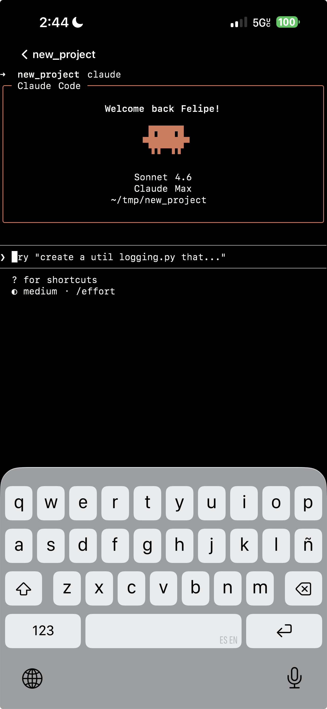

# RemoteX

Access your Mac terminal sessions from iPhone over Tailscale.

## Screenshot



## What it does

RemoteX lets you connect to persistent tmux sessions running on your Mac directly from your iPhone. It uses mosh for reliable transport, SSH for authentication, and Tailscale for networking — no port forwarding or public IPs required.

## Architecture

```
iPhone (iOS app)  ──mosh/Tailscale──>  Mac (remotex-daemon)
                                             │
                                          tmux sessions
```

- **Mac side:** Go daemon (`remotex-daemon`) manages tmux sessions and spawns mosh-server on demand. A CLI (`remotex`) controls the daemon.
- **iOS side:** SwiftUI app with libmosh + SwiftTerm renders a full terminal.
- **Auth:** Ed25519 SSH keypair + API key, shared once via QR code scan, stored in iOS Keychain.
- **Network:** Tailscale CGNAT (100.x.x.x) — daemon binds only to the Tailscale interface.

---

## Mac Installation

### Prerequisites

```bash
brew install go tmux mosh
```

- **Go 1.25+**
- **tmux** — session management
- **mosh** — provides `mosh-server`, spawned on demand per session
- **Tailscale** — install from [tailscale.com](https://tailscale.com) and sign in on both Mac and iPhone

### Build

```bash
git clone https://github.com/fsaint/remotex.git
cd remotex/mac
go build -o ../bin/remotex     ./cmd/remotex
go build -o ../bin/remotex-daemon ./cmd/remotex-daemon
```

### Install to PATH

```bash
sudo cp ../bin/remotex ../bin/remotex-daemon /usr/local/bin/
```

Or add `bin/` to your `$PATH` in `~/.zshrc`:

```bash
export PATH="$HOME/path/to/remotex/bin:$PATH"
```

### First-time setup

```bash
remotex setup
```

This command:
1. Generates an Ed25519 SSH keypair in `~/.remotex/` and appends the public key to `~/.ssh/authorized_keys`
2. Generates a random API key
3. Detects your Tailscale hostname
4. Saves config to `~/.remotex/config.json`
5. Installs and starts `remotex-daemon` as a launchd agent (`com.remotex.daemon`) — it will auto-start on login
6. Prints a QR code for pairing the iOS app

### Start the daemon manually (if needed)

```bash
remotex-daemon
```

Logs are written to `~/.remotex/logs/daemon.log` and `daemon.err`.

### Create and attach to a session

```bash
# In any directory — uses the GitHub repo name or directory name automatically
remotex new

# Or specify a name explicitly
remotex new myproject

# List active sessions
remotex list

# Kill a session
remotex kill myproject
```

---

## iOS Installation

### Prerequisites

- **Xcode 15+**
- **XcodeGen** — generates `RemoteX.xcodeproj` from `project.yml`

  ```bash
  brew install xcodegen
  ```

- **libmosh.xcframework** and **Protobuf_C_.xcframework** — prebuilt binary frameworks from the [Blink Shell](https://github.com/blinksh/blink) open source project. Place them in `ios/Frameworks/`:

  ```
  ios/
    Frameworks/
      mosh.xcframework/
      Protobuf_C_.xcframework/
  ```

### Generate the Xcode project

```bash
cd ios
xcodegen generate
```

This reads `project.yml` and produces `RemoteX.xcodeproj`. Re-run this any time `project.yml` changes.

### Open and configure in Xcode

```bash
open RemoteX.xcodeproj
```

1. Select the **RemoteX** target → **Signing & Capabilities**
2. Set your **Team** to your Apple Developer account
3. Change the **Bundle Identifier** if needed (default: `com.remotex.app`)

### Build and run on device

1. Connect your iPhone via USB (or use wireless pairing)
2. Select your device in the Xcode toolbar
3. Press **⌘R** to build and run
4. On first launch, the app shows a setup screen — scan the QR code printed by `remotex setup` on your Mac

> **Simulator note:** The app runs in the simulator but cannot connect to the daemon because mosh requires a real network path. Use the JSON paste option (`remotex setup` prints the JSON alongside the QR code) to pair without a camera.

### Running tests

```bash
# In Xcode: ⌘U
# Or from the command line:
xcodebuild test -project ios/RemoteX.xcodeproj -scheme RemoteX -destination 'platform=iOS Simulator,name=iPhone 16'
```

---

## Project Structure

```
mac/
  cmd/remotex/          # CLI (new, list, kill, setup)
  cmd/remotex-daemon/   # HTTP daemon (port 7654, Tailscale interface only)
  internal/config/      # ~/.remotex/config.json
  internal/session/     # Session manager + watchdog
  internal/tmux/        # tmux CLI wrapper
  internal/mosh/        # mosh-server spawn/parse
  internal/daemon/      # HTTP server + handlers
  internal/setup/       # Key generation, QR code, launchd

ios/
  RemoteX/App/          # AppRouter, entry point
  RemoteX/Models/       # Session, Credentials, ConnectInfo
  RemoteX/Services/     # KeychainStore, DaemonClient, MoshSession
  RemoteX/Screens/      # SetupView, SessionsView, TerminalView
  RemoteX/Utilities/    # TerminalSizeHelper
  Frameworks/           # libmosh.xcframework, Protobuf_C_.xcframework (not in git)
```
